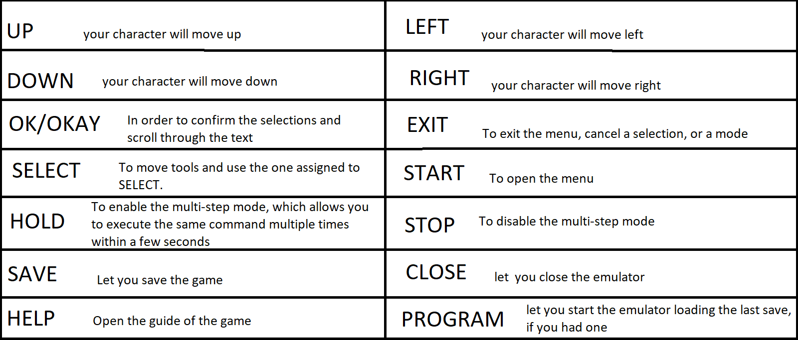

# PokePlay

Benvenuto ain PokePlay! Questo programma ti consente di giocare ai Pokémon utilizzando comandi vocali per controllare il gioco.

## Prerequisiti
- Sistema operativo: Windows
- Microfono funzionante
- Connessione internet stabile (per scaricare il gioco e l'emulatore)
- Capacità di seguire istruzioni vocali

## Istruzioni

### Step 1: Installazione del gioco e dell'emulatore
1. Scarica il gioco Pokémon e l'emulatore compatibile con il tuo sistema operativo.
   Andare sul sito https://www.emulator-zone.com/doc.php/gba/vboyadvance.html, per scaricare l'eumulatore
   Andare sul sito https://wowroms.com/en/roms/nintendo-gameboy-advance/pokemon-versione-rosso-fuoco-italy/13851.html, per scaricare il gioco
3. Assicurati di salvare entrambi i file nella cartella `game` sul tuo computer.

### Step 2: Aprire la guida
1. Naviga nella cartella game.
2. Cerca e apri il file denominato "guida.png".

*Immagine dei Comandi Vocali*

### Step 3: Avviare il gioco utilizzando la voce
1. Assicurati che il tuo microfono sia collegato e funzionante.
2. Eseguire `main.exe`.
3. Segui le istruzioni vocali per iniziare a giocare.
   

## Note aggiuntive
- Se incontri difficoltà nel riconoscimento vocale, assicurati di essere in un ambiente silenzioso e che il microfono funzioni correttamente.
- Consulta la guida fornita con il gioco per informazioni dettagliate su altri comandi e funzionalità.

Divertiti a giocare con i Pokémon utilizzando la tua voce come guida! 🎮✨

